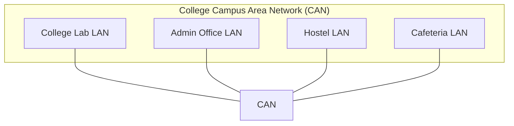

# CAN (Campus Area Network)

🗓️ M/Y: Jul-25  
📂 Category: Network Types - Campus or Metropolitan Networks

---

## What is a CAN?

**CAN = Campus Area Network**  
Basically a big-ass LAN, but for multiple buildings — like a whole college campus, university, military base, hospital complex, or corporate park.

It connects several LANs together using high-speed backbone links (usually [fiber](https://github.com/orze4r/Networking-Journey/blob/main/4.%20Transmission%20Media/4.1%20-%20Wired/4.1.2%20-%20Fiber%20Optics.md) or dedicated leased lines).

Think of it like this:  
Our college lab + admin office + hostel + cafeteria — all are on their own LANs, but they're tied together via a CAN.

---

## Where we’ll find a CAN?

- University campuses (labs, offices, dorms all linked)
- Hospital campuses (labs, ICU, diagnostics center)
- Corporate zones (HR building + Dev building + Canteen 😂)
- Military compounds (secured buildings connected privately)

---

## How does it work?

- **Multiple LANs** are connected using high-speed **backbone networks**
- Uses **switches, routers,** and sometimes **firewalls** between zones
- Devices across buildings can access shared resources like servers, DBs, apps

---

## Why use CAN?

| Reason             | Meaning                                       |
|--------------------|-----------------------------------------------|
| Centralized Control| One IT team manages all connected buildings   |
| High Security      | It’s isolated from public networks            |
| Better Speed       | Faster than routing traffic over the internet|
| Unified Access     | Shared resources work across buildings        |

---

## Fun Facts

- CANs often have their own **[DNS](https://github.com/orze4r/Networking-Journey/blob/main/7.%20Protocols/7.7%20-%20Application%20Layer%20Protocols/DNS.md)**, **[DHCP](https://github.com/orze4r/Networking-Journey/blob/main/8.%20Other%20Network%20Services%20%26%20Practical%20Concepts/DHCP.md)**, or even **mail servers**
- Sometimes use **fiber optic** connections between buildings
- Many CANs are **completely isolated** from the internet (air-gapped)

---
