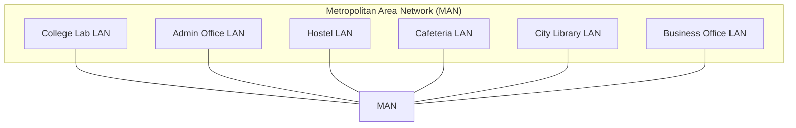

# MAN (Metropolitan Area Network)

🗓️ M/Y: Jul-25  
📂 Category: Network Types - Campus or Metropolitan Networks

---

## What is MAN?

**MAN = Metropolitan Area Network**  
This one is like if a LAN grew up, moved out, and bought its own apartment in the city.

It covers a **whole city or a big urban area** — bigger than a [LAN](https://github.com/orze4r/Networking-Journey/blob/main/2.%20Types/2.1%20-%20Network%20Types/2.1.1%20-%20Personal%20or%20Home%20Networks/LAN.md), smaller than a [WAN](https://github.com/orze4r/Networking-Journey/blob/main/2.%20Types/2.1%20-%20Network%20Types/2.1.3%20-%20Wide%20or%20Specialized%20Networks/WAN.md). Think of it as our city’s digital plumbing.

---

## Where would we see MANs?

- City-wide ISP infrastructure  
- Government networks connecting public services (police, hospitals, etc.)  
- University campuses stretched across a metro  
- Smart city tech (traffic sensors, surveillance systems, public Wi-Fi)

---

## Real-World example?

Let’s say an ISP has **fiber lines running all over Mumbai** — that’s a MAN.

Or our uni has **multiple campuses across a city** that share one mainframe or data center — again, MAN.

---

## How is it built?

Usually a MAN uses:

- **[Fiber optic cables](https://github.com/orze4r/Networking-Journey/blob/main/4.%20Transmission%20Media/4.1%20-%20Wired/4.1.2%20-%20Fiber%20Optics.md)** (city-wide backbones)
- **[Microwave](https://github.com/orze4r/Networking-Journey/blob/main/4.%20Transmission%20Media/4.2%20-%20Wireless/4.2.2%20-%20Microwaves.md) links** (point-to-point)
- **Ethernet rings** (between major buildings)

It’s high-speed and made for **connecting LANs together**.

---

## Comparison Table

| Type | Coverage Area | Example |
|------|---------------|---------|
| LAN  | One building/home | Our house Wi-Fi |
| MAN  | Whole city area | Our ISP's core city network |
| WAN  | Country/Continent | The internet itself |

---

## Fun Fact

Some cities used to provide public MANs — like **free city-wide Wi-Fi**.  
It flopped often due to **coverage issues**, **budget cuts**, and people just streaming YouTube in 144p from rooftops

---

## Summary

- MAN connects LANs across a city
- Built using fiber, radio, or metro-Ethernet
- Sits between LAN and WAN
- Common in ISPs, universities, and smart cities

---

