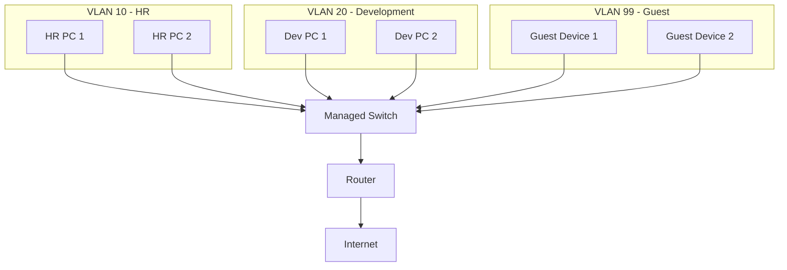

# VLAN – Virtual Local Area Network

🗓️ M/Y: Jul-25  
📂 Category: Network Types - Campus or Metropolitan Networks

---

> Think of VLANs as **invisible walls** inside our network.  
They let us split a big group of devices into **smaller, isolated sections** — even if they’re all plugged into the same [switch](https://github.com/orze4r/Networking-Journey/blob/main/3.%20Network%20Hardware%20%26%20Topologies/3.1%20-%20Devices/3.1.3%20-%20Switch.md).

---

## What is a VLAN?

A **VLAN (Virtual LAN)** lets us group devices **logically**, not physically.

- All devices in a VLAN can talk **to each other** directly.
- Devices in **different VLANs** **can’t talk** unless a **router or Layer 3 switch** is involved.
- VLANs use the **[IEEE 802.1Q](https://en.wikipedia.org/wiki/IEEE_802.1Q)** standard for tagging packets.

> Even if everyone's connected to the same switch, VLANs **act like separate networks**.

---

## Why do we use VLANs?

| Reason           | Benefit                                                                 |
|------------------|-------------------------------------------------------------------------|
| 🔐 **Security**     | Isolate sensitive systems (e.g., HR, finance)                          |
| 🌐 **Efficiency**   | Reduce unnecessary traffic between unrelated devices                  |
| 🧑‍💻 **Organization** | Group users by role (e.g., Students, Staff, Guests)                   |
| 🚦 **Broadcast Control** | Broadcasts stay **inside** the VLAN, not across the entire network |
| 🧰 **Simpler Management** | Easier to track, segment, and troubleshoot                        |

---

## Real-World Example

### Scenario: One Office, Many Departments

We're managing a network for a small office with just one switch. We don’t want everyone’s devices talking to each other.

So, we divide it into VLANs:

| Department | Ports on Switch | VLAN ID |
|------------|------------------|---------|
| HR         | 1–5              | 10      |
| Development| 6–15             | 20      |
| Guest Wi-Fi| 16–24            | 99      |

 **Now:**
- HR can't snoop on Dev.
- Guests can’t access internal systems.
- Broadcast traffic stays in each VLAN.

> This is **network segmentation** done right — without buying separate switches.

---

## VLAN Tagging (802.1Q Explained)

VLAN tags are tiny labels inside Ethernet frames that say:  
“Hey! I belong to VLAN 20!”

There are two kinds of switch ports:

| Port Type     | Use Case                            |
|---------------|--------------------------------------|
| **Access Port** | Belongs to ONE VLAN (for PCs, printers) |
| **Trunk Port**  | Carries traffic from **multiple VLANs** (used between switches or router-switch) |

---

## Configuration (Cisco Style)

```bash
# Assign a port to VLAN 10
Switch(config)# interface FastEthernet 0/3
Switch(config-if)# switchport mode access
Switch(config-if)# switchport access vlan 10

# Make a port a TRUNK (for multiple VLANs)
Switch(config)# interface FastEthernet 0/24
Switch(config-if)# switchport mode trunk
```

---

# Inter-VLAN Routing

> Devices in different VLANs cannot communicate directly.

We need a router (or Layer 3 switch) to make that happen. This is called **Inter-VLAN Routing**.


---

##  Important VLAN IDs

VLAN ID	Meaning

- 1	Default VLAN (avoid for prod)
- 2–1001	Normal Range (recommended)
- 1002–1005	Reserved (for legacy protocols)
- 1006–4094	Extended Range (may not be supported by all switches)


---

## Common Misunderstandings

- VLANs ≠ VPNs → VLANs isolate internally. VPNs encrypt across internet.
- VLANs are not firewalls, just segmentation.
- Just using VLANs doesn’t secure everything — we still need proper ACLs and routing rules.

---

## Summary

- VLANs = Virtual Segments.
- They reduce chaos, isolate traffic, and make networks cleaner.

>  "One physical switch. Many logical networks. That’s VLAN magic."

---


