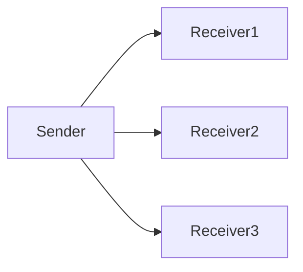

# Broadcast

🗓️ M/Y: Aug-25  
📂 Category: Networking - Communication Types  

---

## What is Broadcast now?

**Broadcast = One-to-All communication**  
Just like it sounds — one sender sends data, and **everyone on the network** receives it. Think of it like shouting in a room; everyone hears you.  

---

## Where do we see Broadcast?

- [ARP](https://github.com/bwbearr/Field-Notes/blob/368359e3debc95205ff2e9d0feab076231558186/Networking/7.%20Protocols/7.2%20-%20Data%20Link%20Layer%20Protocols/ARP.md) requests (who has IP X? everyone listens)  
- [DHCP](https://github.com/bwbearr/Field-Notes/blob/368359e3debc95205ff2e9d0feab076231558186/Networking/8.%20Other%20Network%20Services%20%26%20Practical%20Concepts/DHCP.md) Discover messages (looking for a DHCP server)  
- Some older LAN protocols that send data to all devices  
- Occasionally in local gaming setups for device discovery

---

## Why it’s useful?

- Lets a device **talk to everyone** without knowing their addresses  
- Handy for discovery services (finding printers, routers, servers)  
- Works great in **small networks** where everyone needs the message

---

## Any downsides?

- Not efficient for large networks — everyone gets the data, even if they don’t need it  
- Can cause **network congestion** if overused  
- Security risk: everyone can “see” the broadcast, including attackers

---

## Quick visual 

Everyone in the network segment receives the message

---

## Overall

- Broadcast = one-to-all communication
- Useful for discovery and network-wide messages
- Efficient only in small/local networks, otherwise beware of congestion

---
