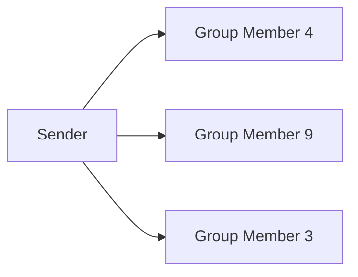

# Multicast

🗓️ M/Y: Aug-25  
📂 Category: Networking - Communication Types  

---

## What the heck is Multicast now?

**Multicast = One-to-Many communication**  
Unlike Unicast (one-to-one) or Broadcast (one-to-all), Multicast sends data from **one sender to a specific group** of receivers. Think of it like inviting a select group to a party — only the invited devices get the data.  

---

## Where do we see Multicast?

- IPTV streaming to a group of subscribers  
- Online gaming lobbies (sending game updates to a team)  
- Video conferencing where only participants in a call receive the stream  
- Some enterprise applications for group updates

---

## Why it’s useful?

- Efficient: the sender **doesn’t need to send multiple copies** to each device  
- Reduces network congestion compared to Broadcast for large groups  
- Keeps communication targeted to the right audience  

---

## Any downsides?

- Requires **group management** (devices must join/leave multicast groups)  
- Not all networks or routers support multicast well  
- Can be tricky to configure in enterprise environments  

---

## Quick visual 

Only the selected group members receive the data

---

## Overall

- Multicast = one-to-many communication
- Perfect for targeted group messages, streaming, or updates
- More efficient than Broadcast when only a subset of devices needs the info

---
