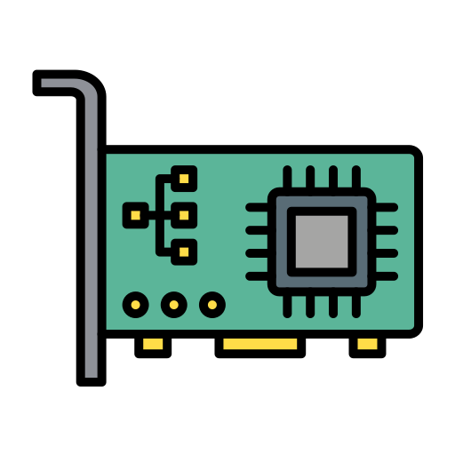

# NIC (Network Interface Card)

🗓️ M/Y: Jul-25  
📂 Category: Network Hardware - Devices

---

## What is an NIC?

NIC = Network Interface Card  *`(not National Informatics Centre lmao)`*

It's basically that little piece of hardware in our laptop, desktop, or even phone that lets our device *talk* to a network.

Without it, our device is just… lonely. It has no idea how to connect to the internet, LAN, Wi-Fi, anything.  
No NIC = no network.

---

## What it does

- Gives our device a **[MAC](https://github.com/orze4r/Networking-Journey/blob/main/5.%20Network%20Addressing%20&%20Identity/5.2%20-%20MAC%20Addressing/5.2.1%20-%20What%20is%20a%20MAC%3F.md) address** (hardware ID)
- Transmits and receives data over a network
- Can be **wired [(Ethernet)](https://github.com/orze4r/Networking-Journey/blob/main/4.%20Transmission%20Media/4.1%20-%20Wired/4.1.1%20-%20Ethernet.md)** or **wireless (Wi-Fi)**
- Converts digital data from our computer into signals for the network

---

## 🧩 Types of NICs

| Type | Use |
|------|-----|
| 🧷 **Ethernet NIC** | RJ45 port → Wired connection |
| 📶 **Wireless NIC (Wi-Fi)** | Built-in on laptops/phones → connects over Wi-Fi |
| 🌐 **Virtual NIC** | Used in virtual machines (VMs) to emulate real NICs |
| 🔌 **USB NIC** | External NIC we plug into USB port for wired or wireless access |
| 🚀 **Fiber NIC** | Used in high-speed enterprise setups (expensive af) |

---

## Physical NIC example

- We know that RJ45 port on our laptop?
- That’s part of our Ethernet NIC.
- It’s not just a port — inside, it’s connected to a chip that handles all networking at the hardware level.

---

## Summary

- Each NIC has a **unique MAC address**
- NIC is responsible for **[Layer 2 (Data Link Layer)](https://github.com/orze4r/Networking-Journey/blob/main/6.%20Reference%20Models/6.1%20-%20The%20OSI%20Model/6.1.3%20-%20Layer%202%20-%20The%20Data%20Link%20Layer.md)** stuff in the [OSI Model](https://github.com/orze4r/Networking-Journey/tree/main/6.%20Reference%20Models/6.1%20-%20The%20OSI%20Model)
- NIC is where **[IP addressing](https://github.com/orze4r/Networking-Journey/tree/main/5.%20Network%20Addressing%20%26%20Identity/5.1%20-%20IP%20Addressing) meets physical hardware**
- When we type `ip a` or `ifconfig`, we're seeing NIC-related stuff

---

## Where it shows up in real life

- In Termux or any other terminal, when we check our IP or interface (like `wlan0`, `eth0`) — we're dealing with NICs
- On Windows, “Network Adapters” section in Device Manager = NICs
- When we disable Wi-Fi from control panel or taskbar — we're toggling an NIC

---

## Fun Note

An NIC doesn't care whether we're visiting Google or playing Valorant — all it sees is **packets**.  
We tell it "go there", and it sends data. That’s it. It's dumb but fast.

---

*it's just a small hardware, either pre-soldered or externally attached*
