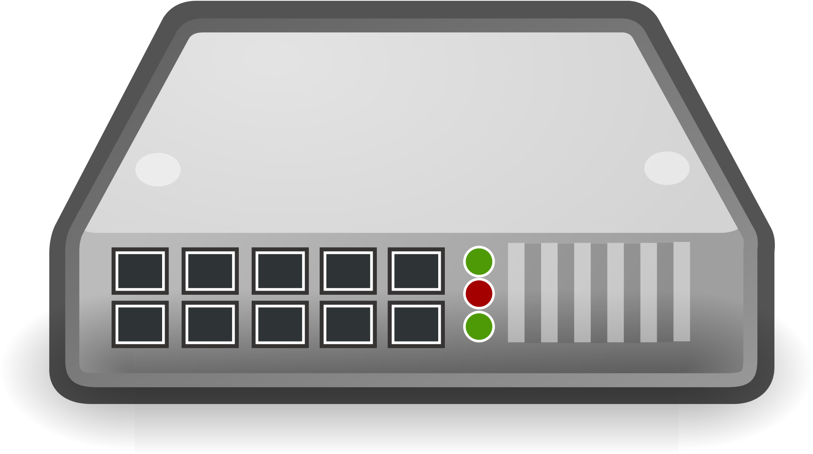

# Hub

🗓️ M/Y: Jul-25  
📂 Category: Network Hardware - Devices

---

## What is a Hub?

A **Hub** is that *dumb-but-kind-hearted* guy in a network.  
It connects multiple devices together — but it doesn't **think** at all.  
It just takes whatever data comes in, and sends it to **everyone**.

Like someone in our group chat who shares random memes with all — even if it's not meant for everyone.

---

## How it works

- A hub has **multiple ports** (like 4, 8, 16, etc.).
- If one device sends data to the hub, it **broadcasts** that data to **all other devices**.
- It doesn't care who the actual receiver is.

Basically:  
> "Oh, you sent something? Cool. Let me scream it out to the whole network."

---

##  Types of Hubs

| Type            | Description |
|-----------------|-------------|
| **Active Hub**  | Boosts (amplifies) the signal before forwarding. Needs power. |
| **Passive Hub** | Just splits the signal. No power or signal boost. |
| **Smart Hub**   | Has a bit of control and management. Still mostly dumb tho. |

---

## Why Hubs ain't useful (Now)

- **No filtering.** Everyone gets everything. That's not cool.
- **Collisions** happen easily when 2 devices talk at the same time.
- **Security?** LOL. Even your grandma can sniff packets here.
- **Outdated.** People don’t really use hubs anymore — [switches](https://github.com/orze4r/Networking-Journey/blob/main/3.%20Network%20Hardware%20%26%20Topologies/3.1%20-%20Devices/3.1.3%20-%20Switch.md) took over.

---

## When were they useful?

- Back in the 90s or early 2000s (before switches became cheap and smart).
- For very simple networks where cost > logic.

---

## Summary

A **hub** is the most basic network connecting device. It’s dumb. It’s loud. It’s outdated.  
But yeah, it walked so switches could run.

---

*(pro tip: hub is just a dumber version of switch)*
