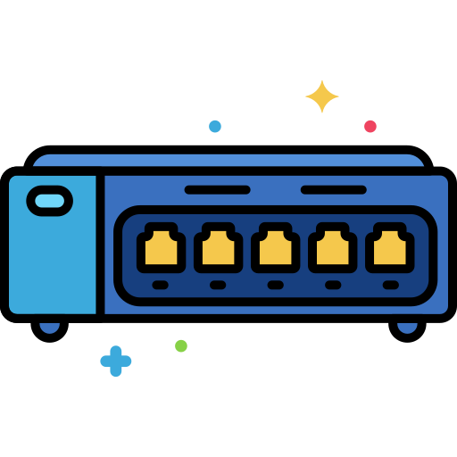

# Switch

🗓️ M/Y: Jul-25  
📂 Category: Network Hardware - Devices  

---

## What is a Switch?

A **switch** is like that one smart person at a party who knows *exactly* who said what and who it's meant for — so they deliver it without shouting.

Basically:  
It connects multiple devices in a [LAN](https://github.com/orze4r/Networking-Journey/blob/main/2.%20Types/2.1%20-%20Network%20Types/2.1.1%20-%20Personal%20or%20Home%20Networks/LAN.md) (Local Area Network), and sends data *only* to the device it's meant for.  
Not like [hubs](https://github.com/orze4r/Networking-Journey/blob/main/3.%20Network%20Hardware%20%26%20Topologies/3.1%20-%20Devices/3.1.2%20-%20Hub.md), which scream the message to everyone.  

---

## How it actually works

- It listens quietly.
- Learns who’s connected to which port (via their [MAC addresses](https://github.com/orze4r/Networking-Journey/blob/main/5.%20Network%20Addressing%20%26%20Identity/5.2%20-%20MAC%20Addressing/5.2.1%20-%20What%20is%20a%20MAC%3F.md)).
- Stores this in a MAC address table.
- When data comes in, it checks the table and sends it **only** to the correct device.
- If it doesn't know who the hell that MAC is — it temporarily turns into a hub and floods the message to everyone once.

After that? It remembers.

---

## Let’s visualize:

| Port | MAC Address     |
|------|------------------|
| 1    | A1:A1:A1:A1:A1:A1 |
| 2    | B2:B2:B2:B2:B2:B2 |
| 3    | C3:C3:C3:C3:C3:C3 |

So if device on Port 1 wants to message device on Port 3 —  
Only **Port 3** gets the message.  
Ports 2 and 1 don’t even know anything happened.

---

## Kinds of Switches

| Type      | What it does                        |
|-----------|-------------------------------------|
| Unmanaged | Plug-and-play, zero config, dumb    |
| Managed   | Fancy AF — lets you configure VLANs, monitor traffic, set limits, add filters, etc.  

Managed = our Linux-styled control freak  
Unmanaged = our cheap TP-Link plastic dude

---

## OSI Layer?

Switch works at **[Layer 2 (Data Link)](https://github.com/orze4r/Networking-Journey/blob/main/6.%20Reference%20Models/6.1%20-%20The%20OSI%20Model/6.1.3%20-%20Layer%202%20-%20The%20Data%20Link%20Layer.md)**  
It doesn’t give a damn about IP addresses — it looks at **MAC addresses**

Some advanced switches [(Layer 3)](https://github.com/orze4r/Networking-Journey/blob/main/6.%20Reference%20Models/6.1%20-%20The%20OSI%20Model/6.1.4%20-%20Layer%203%20-%20The%20Network%20Layer.md) can route using IPs too — they’re kind of hybrid switch-router thingies.

---

## Real-life note

We’ve probably used a switch without knowing. That little black box behind our office router or in labs with 24 ports? Yep — that’s the guy.

Sometimes routers have a mini 4-port switch built-in too.

---

## Summary

- Switch forwards data to the right MAC, not to everyone.
- It’s way better than a hub.
- It learns with time — builds a MAC table.

---

## In a sentence?

> A switch is just a super quiet gossip expert. Learns everything, tells exactly what’s needed, and keeps the rest out of the loop.

---
