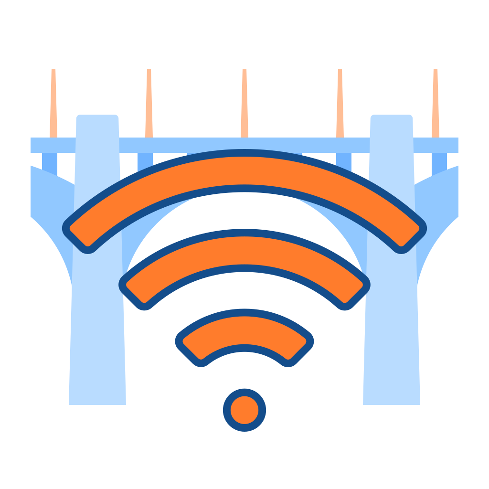
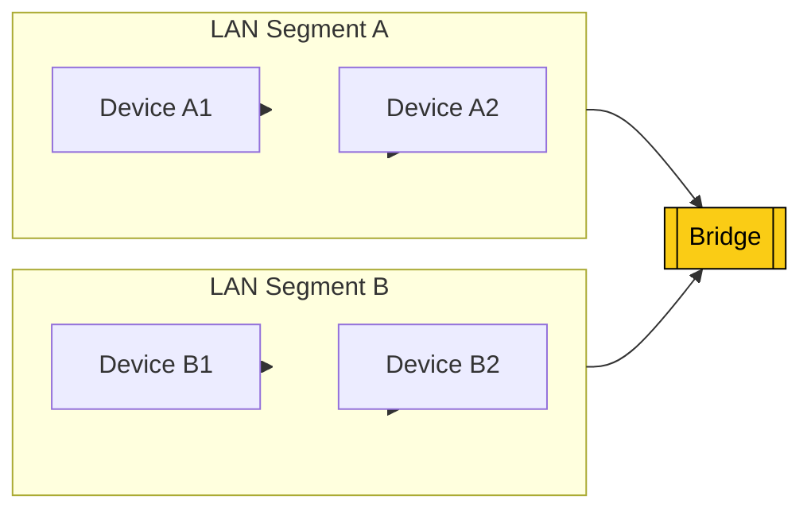

# Bridge

🗓️ M/Y: Jul-25  
📂 Category: Network Hardware - Devices

---

## What even is a Bridge?

A **network bridge** is like a translator between two LANs (Local Area Networks).

It's used to **connect two separate networks** — usually to make them act like one big happy family.

We could say:
> A **[hub](https://github.com/bwbearr/Field-Notes/blob/ce514e369aae7e6edb1b3c62f818f565ce967552/Networking/3.%20Network%20Hardware%20%26%20Topologies/3.1%20-%20Devices/3.1.2%20-%20Hub.md)** talks to all devices,  
> A **[switch](https://github.com/bwbearr/Field-Notes/blob/ce514e369aae7e6edb1b3c62f818f565ce967552/Networking/3.%20Network%20Hardware%20%26%20Topologies/3.1%20-%20Devices/3.1.3%20-%20Switch.md)** talks smartly inside one LAN,  
> A **bridge** brings **two LANs** together.

---

## What it does

- Connects two different **network segments**
- Operates at **[Data Link Layer](https://github.com/bwbearr/Field-Notes/blob/ce514e369aae7e6edb1b3c62f818f565ce967552/Networking/6.%20Reference%20Models/6.1%20-%20The%20OSI%20Model/6.1.3%20-%20Layer%202%20-%20The%20Data%20Link%20Layer.md) (Layer 2)** of OSI
- Filters traffic based on **MAC addresses**
- Helps reduce collision and segment large networks

---

## Where it’s useful?

- Extending a wired LAN across floors or buildings
- Separating departments but still needing them to share resources
- Legacy networks where full replacement isn’t possible

---

## Bridge vs Switch vs Router

| Feature           | Bridge       | Switch        | Router         |
|------------------|--------------|---------------|----------------|
| OSI Layer        | Layer 2      | Layer 2       | Layer 3        |
| IP Awareness     | ❌ No         | ❌ No          | ✅ Yes          |
| MAC Filtering    | ✅ Yes        | ✅ Yes         | ❌ No           |
| Interconnect LANs| ✅ Yes        | ❌ No          | ✅ Yes (via IP) |

---

## Types of Bridges

| Type          | What it does |
|---------------|--------------|
| **Transparent Bridge** | You won’t even notice it’s there. It just silently connects two LANs. |
| **Wireless Bridge**    | Connects two wired networks over a wireless link (e.g., rooftop antennas). |
| **Translational Bridge** | Converts one type of network to another (like Ethernet to Token Ring — rare now). |

---

## Fun Facts

- Modern switches often have **bridge functionality built-in**.
- Bridges are kinda old-school now, but useful in some niche cases.
- Not used as often in modern home setups, but still found in enterprises or rural extensions.

---

## Summary

A **Bridge** helps combine two LANs into one.  
It doesn’t route, doesn’t assign IPs, doesn’t care about the Internet — it just connects two network zones so they work together.

> Basically… it's that cool old uncle in networking who makes sure both sides of the family party together.

---

