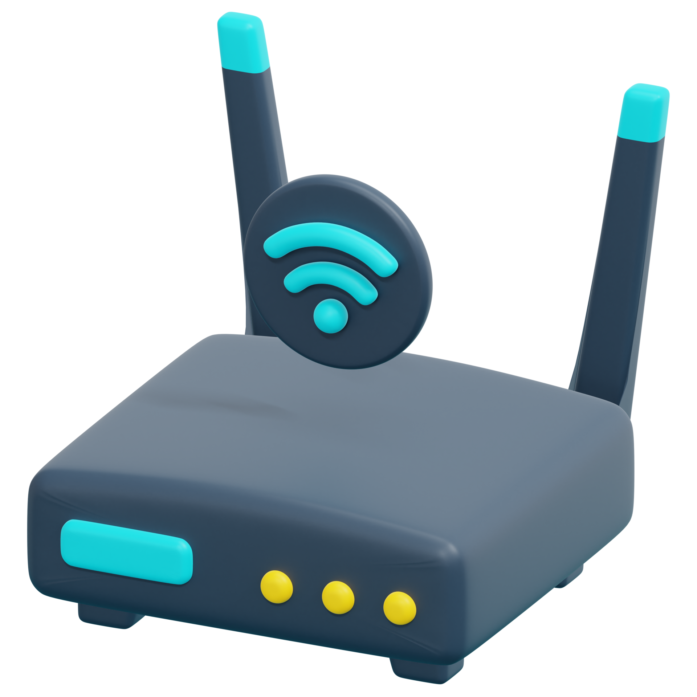

# Router

🗓️ M/Y: Jul-25  
📂 Category: Network Hardware - Devices

---

## What is a Router?

A **router** is that one smart dude in the network who decides *where the packet should go*. It looks at the destination [IP](https://github.com/bwbearr/Field-Notes/tree/f1c12b09920d674fb5c383069e01d4162f8b5dd7/Networking/5.%20Network%20Addressing%20%26%20Identity/5.1%20-%20IP%20Addressing) and goes:  
> "Alright, I know where this should be sent — this way bruh."

It **routes** traffic between **networks**, not just devices.

Example:  
- Sends data from our home Wi-Fi to the internet  
- Connects two different offices over [WAN](https://github.com/bwbearr/Field-Notes/blob/f1c12b09920d674fb5c383069e01d4162f8b5dd7/Networking/2.%20Types/2.1%20-%20Network%20Types/2.1.3%20-%20Wide%20or%20Specialized%20Networks/WAN.md)  
- Knows how to forward traffic from one subnet to another

---

##  What it actually does

- **Connects different networks**  
  Our home LAN ↔ the Internet (WAN)  
  One subnet ↔ another subnet

- **Forwards packets** based on destination IP  
  It looks at the destination IP in each packet and chooses the best path to send it.

- **Assigns IPs** to devices using [DHCP](https://github.com/bwbearr/Field-Notes/blob/f1c12b09920d674fb5c383069e01d4162f8b5dd7/Networking/8.%20Other%20Network%20Services%20%26%20Practical%20Concepts/DHCP.md)  
  Our phone didn’t make up that `192.168.x.x` — the router gave it.

- **Does [NAT](https://github.com/bwbearr/Field-Notes/blob/f1c12b09920d674fb5c383069e01d4162f8b5dd7/Networking/5.%20Network%20Addressing%20%26%20Identity/5.1%20-%20IP%20Addressing/5.1.8%20-%20NAT%20%26%20CGNAT.md)** (Network Address Translation)  
  So our private IP like `192.168.1.5` can talk to YouTube's public IP.

---

##  Where it sits in OSI?

**[Layer 3](https://github.com/bwbearr/Field-Notes/blob/f1c12b09920d674fb5c383069e01d4162f8b5dd7/Networking/6.%20Reference%20Models/6.1%20-%20The%20OSI%20Model/6.1.4%20-%20Layer%203%20-%20The%20Network%20Layer.md)** – The Network Layer.  
Because it deals with IP addresses, not MACs like switches.

---

##  Router vs Modem vs Switch

| Device  | Job  | Layer |
|--------|------|--------|
| Router | Connects networks and routes data | Layer 3 |
| Modem  | Converts digital ↔ analog for ISP | Layer 1 |
| Switch | Connects devices within the same network | Layer 2 |

> **In Short:**  
> Modem = Translator  
> Router = Decision Maker  
> Switch = Gossip Organizer

---

## 🏠 In Home Networks

- Our ISP gives us a box (combo of router + modem sometimes)
- We connect our phone/laptop to it
- It gives IPs, lets us access internet, does NAT, and sometimes parental control (which we bypass anyway)

---

## 🌐 In big networks

- Routers use **routing protocols** like RIP, OSPF, BGP to communicate and share paths
- Can have multiple [WAN](https://github.com/bwbearr/Field-Notes/blob/f1c12b09920d674fb5c383069e01d4162f8b5dd7/Networking/2.%20Types/2.1%20-%20Network%20Types/2.1.3%20-%20Wide%20or%20Specialized%20Networks/WAN.md) connections, [VLANs](https://github.com/bwbearr/Field-Notes/blob/f1c12b09920d674fb5c383069e01d4162f8b5dd7/Networking/2.%20Types/2.1%20-%20Network%20Types/2.1.2%20-%20Campus%20or%20Metropolitan%20Networks/VLAN.md), static/dynamic routes
- Often managed via CLI (Cisco IOS, etc)

---

##  Other things that routers might Do

- **Firewall rules** (basic ACLs)
- **Port forwarding** (will be covered separately)
- **QoS (Quality of Service)**: prioritize gaming over our sibling’s TikTok
- **[VPN](https://github.com/bwbearr/Field-Notes/blob/f1c12b09920d674fb5c383069e01d4162f8b5dd7/Networking/9.%20Security%20Concepts/VPN.md) passthrough** support

---

##  Funny & Brutal Truths

- Most routers in homes are *dumbed-down plastic boxes* that never get firmware updates.
- Changing SSID from `LazyFruit_5GHz` to `NSA_Surveillance_Van` = real power move.
- ISP-given routers often have open backdoors or default credentials (`admin:admin` 🤡)
- We can change our life by logging into `192.168.1.1` and clicking around like a wizard (or bricking it 💀)

---

## Summary

> A router is our internet's GPS. It reads the IP address, checks the map (routing table), and forwards the packet to its next stop.  
> No router = no path = no internet.

---
