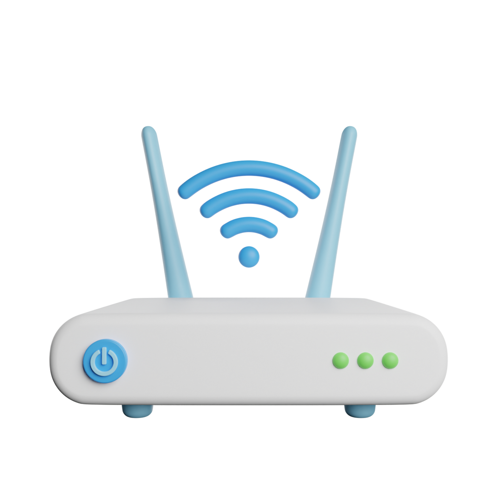
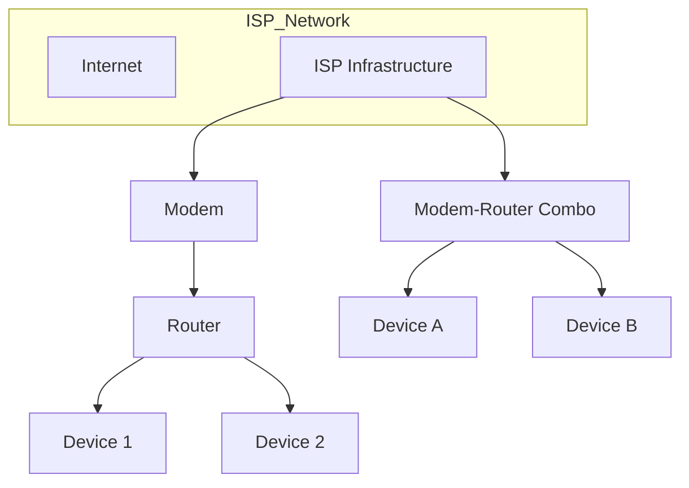

# Modem

🗓️ M/Y: Jul-25  
📂 Category: Network Hardware - Devices  

---

## What is a Modem?

**Modem** stands for:  
**MO**dulator + **DEM**odulator

Basically, it’s the translator between our home and our ISP.  
It converts analog signals (from telephone/fiber lines) into digital data our computer can understand — and vice versa.

Think of it like this:
> We speak English. ISP speaks Martian. Modem = Translator.

---

## What does a Modem do?

- Takes the signal from our ISP (via DSL, cable, or fiber).
- Converts it into data that our router/PC can use.
- Sends our outgoing digital data back into analog (or light, in case of fiber).

---

## Modem vs Router?

| Thing   | Modem | Router |
|--------|--------|--------|
| Talks to ISP? | ✅ Yes | ❌ No |
| Talks to Devices? | ❌ No | ✅ Yes |
| Gives Wi-Fi? | ❌ No | ✅ Usually |
| Function | Signal conversion | Local network management |

**Important:**  
Most homes today use a **modem-router combo**.  
(1 box, 2 jobs — because companies love confusing people.)

---

## Types of Modems

| Type         | Connection |
|--------------|------------|
| DSL Modem    | Phone line |
| Cable Modem  | Coaxial    |
| Fiber Modem (ONT) | Optical fiber |
| Dial-Up Modem | 🗿 Ancient history |

---

## Where is it used?

- At our home — when connecting to our ISP.
- In data centers — often paired with routers/firewalls.
- With fiber — we might get a modem + ONU/ONT.

---

## Do we still need a Modem?

- If we have fiber: yes (but it’s probably inside that white/green ONU box).
- If we're on cable/DSL: absolutely yes.
- If we're using 4G/5G: the SIM module **is** our modem.

---

## Summary

A **modem** brings the internet into our home.  
It speaks both ISP language and computer language.  
We can't surf the net without it — unless we live inside your ISP’s datacenter XD.

---

