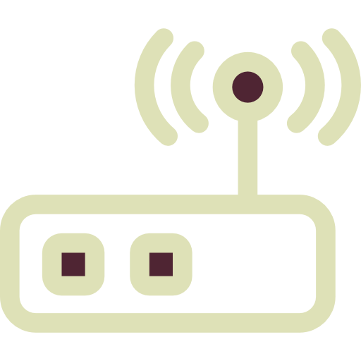

# 📡 Access Point (AP)

🗓️ M/Y: Jul-25  
📂 Category: Network Hardware - Devices  

---

## What is an Access Point?

An **Access Point (AP)** is the thing that gives us [Wi-Fi](https://github.com/orze4r/Networking-Journey/blob/main/4.%20Transmission%20Media/4.2%20-%20Wireless/4.2.3%20-%20WiFi.md).  
That's it. No overthinking.

We connect to it with our phone, laptop, smart TV — and it bridges us into the actual network.

Think of it like:
> Our device → air (Wi-Fi) → Access Point → router/modem → Internet

---

## What does it actually do?

- Acts as a **wireless entry point** into the network
- Converts **wired** signal (Ethernet) to **wireless**
- Handles device authentication (passphrase, MAC filtering, etc.)

---

## Access Point vs Router

| Feature         | Access Point | Router |
|----------------|--------------|--------|
| Gives Wi-Fi     | ✅ Yes        | ✅ Yes (usually) |
| Has Routing Logic | ❌ No         | ✅ Yes |
| Connects Devices | ✅ Yes        | ✅ Yes |
| Needs to be wired into router? | ✅ Yes | ❌ No (it's the router itself) |

In most homes, the **router already has a built-in AP**.  
But in bigger setups (like offices, hotels), we’ll see dedicated APs everywhere.

---

## Where is it used?

- 🏠 Homes (built into our router)
- 🏢 Offices and campuses (as separate ceiling-mounted units)
- 🚌 Public Wi-Fi zones (airports, cafés, etc.)

---

## Types of APs

| Type        | Where It’s Used |
|-------------|-----------------|
| Standalone AP | Offices, enterprise setups |
| Built-in Router AP | Home routers |
| Mesh APs | Smart homes for full coverage |
| Outdoor APs | Long-range Wi-Fi (parks, stadiums) |

---

## Fun Facts

- Dual-band APs support both 2.4 GHz and 5 GHz (some also 6 GHz now).
- Wi-Fi 6/6E/7 are just newer generations supported by modern APs.
- APs don’t assign IPs — they just provide the medium for our device to talk. Router handles the IP via [DHCP](https://github.com/orze4r/Networking-Journey/blob/main/8.%20Other%20Network%20Services%20%26%20Practical%20Concepts/DHCP.md).

---

## Summary

An **Access Point** is like our Wi-Fi gatekeeper.  
Without it, we’d be dragging LAN cables everywhere like it’s 2005.

---
