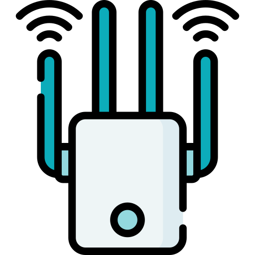

# Repeater/Extender

🗓️ M/Y: Jul-25  
📂 Category: Network Hardware - Devices  

---

## What is a Repeater?

A **Repeater** is a networking device that **takes a weak signal and re-transmits it** — just to stretch the distance.

It doesn’t care what the data is, it just boosts the signal.  
Doesn’t decode, doesn’t look at IPs or MACs — just repeats the signal like a parrot. 🦜

---

## When do we use it?

- When the Wi-Fi signal is **weak in far rooms**
- When we want to **extend network coverage**
- When thick walls or large houses mess up our Wi-Fi

---

## How does it work?

- Repeater sits somewhere **between our [router](https://github.com/bwbearr/Field-Notes/blob/b6a8dc53c3b99e0ff2d7fb453b447e24023c6d57/Networking/3.%20Network%20Hardware%20%26%20Topologies/3.1%20-%20Devices/3.1.5%20-%20Router.md) and the dead zone**
- Picks up the Wi-Fi signal, **cleans it**, and **rebroadcasts** it
- Devices in the far corner now connect to the repeater’s signal instead of the weak router one

---

## Repeater vs Extender vs Booster?

They’re often used interchangeably (especially in marketing), but:

| Term       | Meaning |
|------------|---------|
| **Repeater** | Just repeats the signal without modification. Layer 1. |
| **Extender** | Usually connects to router and creates a **new Wi-Fi network** with better coverage. |
| **Booster**  | Generic word, usually means repeater or extender depending on brand. |

In most cases, “Wi-Fi Extender” = smarter repeater that creates a new SSID like `Home_WiFi_EXT`.

---

## Pros and Cons

### ✅ Pros:
- Easy to set up
- Cheap fix for weak signals
- No need for new cabling

### ❌ Cons:
- Adds **latency**
- Cuts **bandwidth in half** (since it talks to router and device on same channel)
- Doesn’t help with **congestion or interference**

---

## Summary

A **Repeater** or **Extender** is like a megaphone for our Wi-Fi.  
It doesn’t solve deep network problems — it just makes the signal louder.

> Think of it like shouting our router’s voice to the next room.  
> Helpful, but not always pretty.

---
---

## Bonus: Not Just for Wi-Fi

While repeaters/extenders are most common in Wi-Fi networks, **they also exist for other wireless technologies**, like:

- **Bluetooth Extenders**:  
  Used to increase the range of Bluetooth signals (especially useful for smart home devices or wireless speakers in big homes).

- **Cellular Signal Boosters**:  
  Technically a form of repeater used to improve mobile network signals inside buildings.

So yeah — repeating signals isn’t limited to Wi-Fi. Anywhere there's wireless range issues, someone probably made a repeater for it.

---
