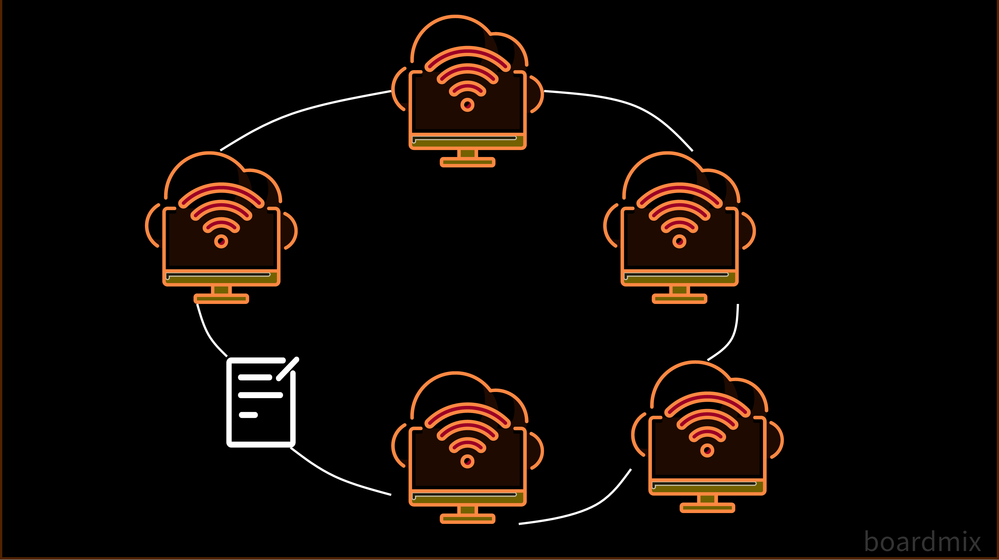

# Ring Topology	

🗓️ M/Y: Aug-25  
📂 Category: Network Topologies

---

## What is Ring Topology?



**Ring Topology = devices connected in a circular fashion, each device has exactly two neighbors.**  

Imagine a **roundtable discussion** — everyone sits in a circle and passes notes to the person next to them.  
Data travels **one direction (or both in dual ring)** until it reaches the destination.

> “Hey, pass this message clockwise!”  
> Next person: “Got it, sending along!”

---

## How devices connect?

- Each device connects to **two neighbors**, forming a closed loop.  
- Data moves **sequentially** through each device.  
- Some networks use **token passing** to prevent collisions (only the device with the token can send data).  

---

## Pros of Ring Topology

| Feature | Why it’s cool |
|---------|---------------|
| Orderly communication | Token passing prevents chaos & collisions |
| Equal access | Every device gets a chance to send data |
| Easy to troubleshoot | If you know the loop, you can check connections sequentially |

---

## Cons of Ring Topology

| Drawback | What it means IRL |
|----------|-----------------|
| Single point failure | One faulty device/cable can break the whole ring |
| Hard to expand | Adding a device means breaking the ring temporarily |
| Slower than Star | Data passes through each device sequentially |

---

## Where do we find it?

- Older LANs (IBM Token Ring)  
- FDDI networks (Fiber Distributed Data Interface)  
- Some modern **MAN setups** with fiber rings  

---

## Real-Life Analogy

Think of a **circular chain of people passing secret notes**.  
- One person missing → the note can’t go around  
- Everyone has a turn → fair communication 🌀

---

## Summary

- Ring topology = **circular connection**  
- Can be unidirectional or bidirectional  
- Token passing reduces collisions  
- Rare today in LANs, mostly historical or fiber MAN setups  

---

## Diagram

```mermaid
graph LR
    PC1[Device 1] --- PC2[Device 2] --- PC3[Device 3] --- PC4[Device 4] --- PC1
