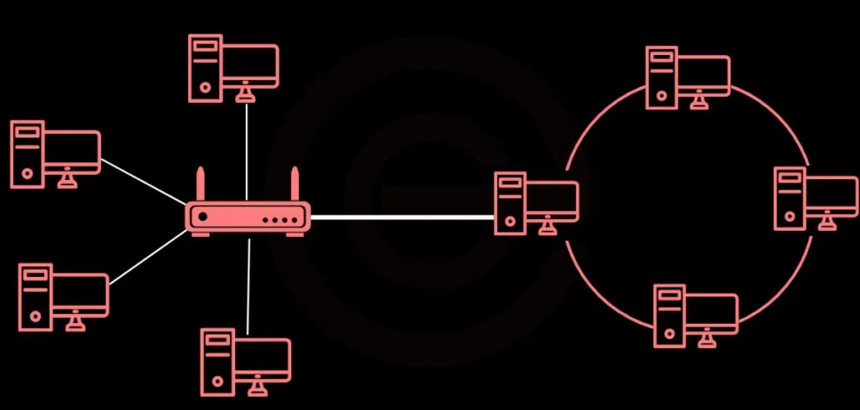

# Hybrid Topology

🗓️ M/Y: Aug-25  
📂 Category: Network Topologies

---

## What is Hybrid Topology?



**Hybrid Topology = mix & match of two or more topologies.**  

Think of it as a **network smoothie**:  
- A little star here,  
- Some bus there,  
- Maybe a mesh in the center.  

> “Why settle for one topology when you can have the best of all?”  
> Network designers: “Flexibility > simplicity.”

---

## How devices connect?

- Combines multiple topologies (Star, Bus, Ring, Mesh)  
- Parts of the network can use **different designs** based on needs  
- Central devices (like switches/routers) often manage communication between different sections  

---

## Pros of Hybrid Topology

| Feature | Why it’s cool |
|---------|---------------|
| Flexible | Can optimize for speed, cost, reliability in different areas |
| Scalable | Easy to expand by adding another topology section |
| Fault-tolerant | Problems in one section don’t usually take down the whole network |

---

## Cons of Hybrid Topology

| Drawback | What it means IRL |
|----------|-----------------|
| Complex | Multiple topologies → harder to manage |
| Costly | More equipment & cabling needed |
| Planning required | Poor design → chaos & bottlenecks |

---

## Where do we find it?

- Large corporate networks  
- University campus networks  
- Data centers & enterprise environments  

---

## Real-Life Analogy

Think of a **big office complex**:  
- Floors with star networks (all devices connect to a switch)  
- Floors connected by bus cables  
- Critical servers in mesh for redundancy  

Everyone can communicate efficiently, even if one part fails. 🏢💻

---

## Summary

- Hybrid topology = **best of multiple topologies combined**  
- Flexible, scalable, fault-tolerant  
- Popular in **large and enterprise networks**  
- Design depends on network size, cost, and performance requirements  

---

## Diagram

```mermaid
graph LR
    subgraph Star Section
        PC1 --- Switch1
        PC2 --- Switch1
        PC3 --- Switch1
    end

    subgraph Bus Section
        PC4 --- Bus
        PC5 --- Bus
    end

    subgraph Mesh Section
        Server1 --- Server2
        Server1 --- Server3
        Server2 --- Server3
    end

    Switch1 --- Router --- Bus
    Router --- Server1
