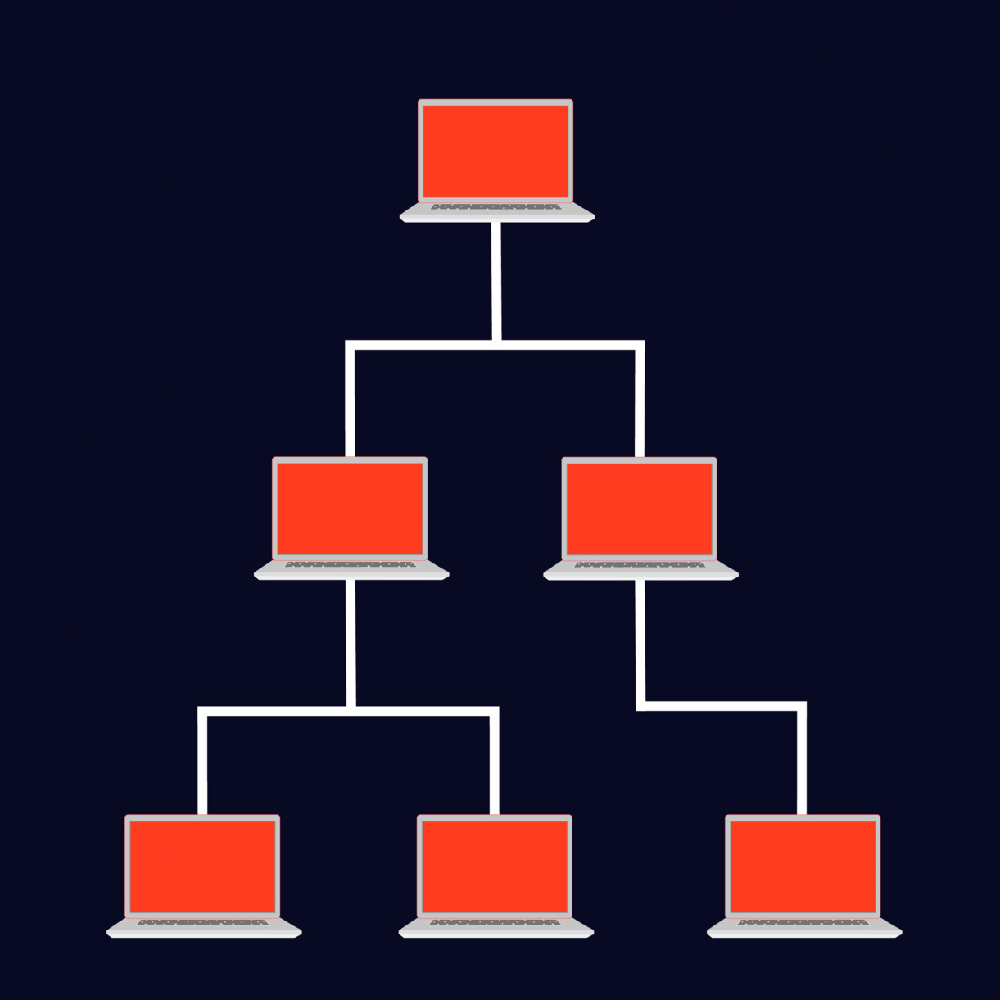

# Tree Topology

🗓️ M/Y: Sep-25  
📂 Category: Network Topologies

---

## What is Tree Topology?




**Tree Topology = a hierarchical network structure shaped like a tree.**  

Think of it like a **family tree** or an org chart:  
- A root node at the top  
- Branches splitting into smaller nodes  
- Leaves at the end (end devices)  

> “Orders flow down from the root through the branches.”  
> Devices: “Copy that, passing it to my children.”

---

## How devices connect?

- Combination of **Star + Bus topology**  
- Root node connects to intermediate nodes, which branch further  
- Each level forms a **parent-child hierarchy**  
- Failure at higher levels can affect everything below it  

---

## Pros of Tree Topology

| Feature | Why it’s cool |
|---------|---------------|
| Scalable | Add more branches without redesigning the whole network |
| Structured | Clear hierarchy = easier management |
| Segmented | Each branch can be managed independently |
| Fault isolation | Local issues don’t usually affect the entire tree |

---

## Cons of Tree Topology

| Drawback | What it means IRL |
|----------|-----------------|
| Root dependency | If the root fails, big sections go offline |
| More cabling | Branching = extra cables & higher cost |
| Maintenance | Large trees = harder troubleshooting |
| Complex design | Needs proper planning to avoid bottlenecks |

---

## Where do we find it?

- Large organizations (departments, multiple floors)  
- ISP & telecom networks (hierarchical design)  
- Universities and campus-wide LANs  

---

## Real-Life Analogy

Imagine a **family tree** 👨‍👩‍👧‍👦:  
- Root = grandparents  
- Branches = parents  
- Leaves = kids (end devices)  

If one parent node fails, their kids lose connection — but other branches still work fine.

---

## Summary

- Tree topology = **hierarchical Star + Bus combo**  
- Scalable, structured, and widely used  
- Root node is critical → failure breaks everything below  
- Perfect for **enterprise, telecom, and campus setups**  

---

## Diagram

```mermaid
graph TD
    Root[Root Node]
    Root --> Switch1[Branch 1 Switch]
    Root --> Switch2[Branch 2 Switch]

    Switch1 --> PC1[Device 1]
    Switch1 --> PC2[Device 2]
    Switch2 --> PC3[Device 3]
    Switch2 --> PC4[Device 4]
