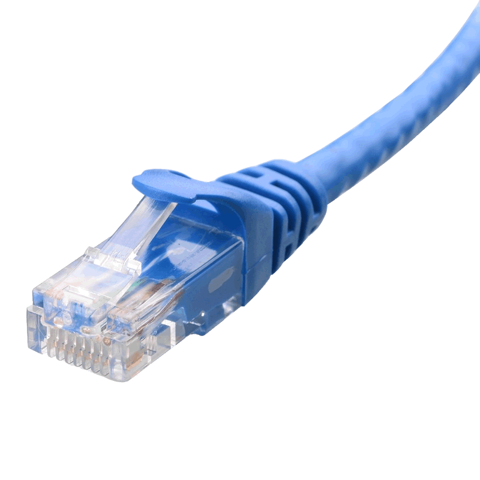

#  Ethernet Cables

🗓️ M/Y: Jul-25  
📂 Category: Transmission Media - Wired/Physical

---

## What is Ethernet?

Ethernet = Wired networking. That’s it.

We plug a cable into a laptop or router → We get stable, fast, no-lag internet.

That cable is usually what people call **[LAN](https://github.com/orze4r/Networking-Journey/blob/main/2.%20Types/2.1%20-%20Network%20Types/2.1.1%20-%20Personal%20or%20Home%20Networks/LAN.md) cable**, **RJ45**, or **Ethernet cable**.  
But internally, they all use a specific type of structure: **twisted pair.**

---

## Inside the Cable — Twisted Pair

Ethernet cables use **Twisted Pair** — means the wires are not straight; they’re literally twisted together.

Why twist them?

- Twisting helps **cancel out electromagnetic interference**
- Keeps our signal **clean, accurate, and fast**
- Without twisting? our internet would suck

### Types of twisted pair cables

| Type  | Full Form                     | Shielding? | Notes                                  |
|-------|-------------------------------|------------|----------------------------------------|
| UTP   | Unshielded Twisted Pair       | ❌         | Common in homes. Cheap and works fine  |
| STP   | Shielded Twisted Pair         | ✅         | Extra protection, used in noisy areas  |
| FTP   | Foiled Twisted Pair           | ✅         | Each pair has foil. Better shielding   |
| S/FTP | Shielded & Foiled Twisted Pair| ✅✅       | Used in high-speed, low-noise networks |
 
We now know why cables have those weird spirals inside — they’re twisted for a damn good reason.

---

## Categories (Cat5e, Cat6, Cat7...)

| Category | Speed           | Max Length | Notes                          |
|----------|------------------|------------|--------------------------------|
| Cat5     | up to 100 Mbps   | 100m       | Old, trash now                 |
| Cat5e    | up to 1 Gbps     | 100m       | Still everywhere, works fine  |
| Cat6     | 1 Gbps / 10 Gbps | 100m       | Modern standard for homes      |
| Cat6a    | 10 Gbps          | 100m       | Thicker, better shielded       |
| Cat7/8   | 10-40 Gbps       | 30-50m     | Overkill unless data center    |

**Cat6** = sweet spot.  
**Cat5e** = still in use.  
**Cat7+** = unless building a cyber bunker lol

---

## RJ45 — The Plug That Rules All

RJ45 = the **8-pin connector** at the end of Ethernet cables.  
We plug it into [routers](https://github.com/orze4r/Networking-Journey/blob/main/3.%20Network%20Hardware%20%26%20Topologies/3.1%20-%20Devices/3.1.5%20-%20Router.md), PCs, gaming consoles — all that.

✅ One connector standard  
✅ But what’s inside the cable (Cat5e vs Cat6 etc.) makes all the difference

---

## Other Cable Terms
| Term      | What It Means                                    |
|-----------|--------------------------------------------------|
| Patch Cable | Short Ethernet cable for nearby connections     |
| Crossover  | Used to directly connect two devices without a switch (rare now) |
| Straight-through | Standard cable — used for most connections |
| Crimping   | The act of attaching RJ45 heads manually         |

---

## Basically

- Ethernet is **faster and more stable** than Wi-Fi.
- **Twisting the wires is not a design choice — it’s science**.
- Cable **shielding = less interference**
- UTP is **common and cheap** but vulnerable in noisy environments
- Ethernet runs on **electrical signals**, not light (like fiber)

---

## How to Identify

- Read the text printed on the cable — it’ll say `Cat6 UTP` or `Cat5e STP` etc.
- Thicker cable usually = better shielding
- Flat cables look clean but are **more fragile**

---

## Ethernet vs Wi-Fi (Raw Truth)

| Feature      | Ethernet (RJ45)  | Wi-Fi              |
|--------------|------------------|--------------------|
| Speed        | Faster           |  Slower            |
| Stability    |  Stable          | Inconsistent       |
| Interference |  Minimal         |  High              |
| Security     |  Better          | Easier to sniff    |
| Portability  | None             |  Full mobility     |

If we’re gaming, streaming, or working — **go wired**.  
Wi-Fi is cool until our ping hits 999 and our face hits the wall.

---

## Real world takeaway

Twisted pair tech is old, but it’s still the **king of cost-efficient, reliable networking**.

Shielding or not — twisting works.  
RJ45 connectors are universal, and if you know Cat5e vs Cat6, you already know more than half of India.

---

## Summary

- Ethernet = wired internet, uses twisted pair copper wires
- RJ45 = the plug, not the cable type
- UTP, STP, FTP = levels of shielding
- Cat6 is better than Cat5e
- Twisted pairs reduce interference
- Longer runs = use better quality cable
- We can identify cable types if we check the print or thickness

---
