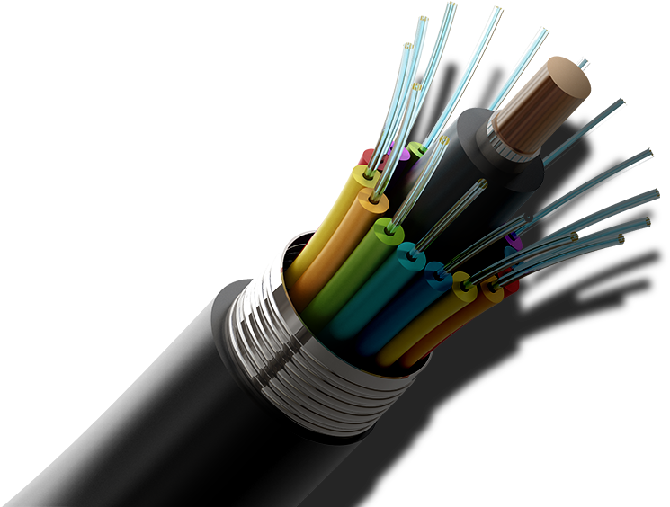

# Fiber Optics

🗓️ M/Y: Jul-25  
📂 Category: Transmission Media - Wired/Physical

---

## What is fiber?

It’s not some sci-fi material. It’s a **super thin glass/plastic wire** that carries **data as light**. Yes. *Light*. Not electricity. 

That’s why it’s crazy fast, less prone to interference, and can handle long distances without signal loss.

---

## What we know

- **Fiber internet** is marketed as the god-tier of connections.  
- Data travels as **light pulses** inside tiny glass strands.
- It’s **not the same as your normal RJ45/Ethernet cable**.
- **No electricity** involved — just **total internal reflection** of laser light (science moment 🧪).

---

## The setup most of us have seen IRL

- **ISPs call it "fiber"**, but they run it *only up to our home* (FTTH — Fiber To The Home).
- What they give us inside our house isn’t actual fiber — it's mostly a tiny yellow cable going into a green box (ONU).
- The **green box** (aka Optical Network Unit) **converts light to electrical signals** — and **then** sends that to our router over RJ45.

✅ We thought that cable was fancy and rare? It is. And it’s expensive.  
✅ That green/white ONU box? Also expensive. But ISPs give it for "free" because… business model magic 🧙

---

## Why fiber is better

| Feature | Fiber Optic | Ethernet/Copper |
|--------|-------------|-----------------|
| Speed | Very high (up to 100+ Gbps) | Limited (1–10 Gbps usually) |
| Distance | Can go kms without signal loss | Limited to 100m per segment |
| Interference | Immune to EMI | Affected by interference |
| Size | Very thin | Bulkier |
| Cost | Expensive infra | Cheap to deploy |

---

## How to identify a fiber cable?

- Thin, stiff, often **yellow** (but not always, sometimes black)
- Connector type is **SC**, **LC**, **ST** — not RJ45 (idk what's that, I just wrote it because i heard it)
- Goes into a **green/white box** `(ONU)`, not directly into our router

---

## Extra nerd info

- **Single-mode** fiber = long distance (used by ISPs)
- **Multi-mode** fiber = shorter runs, usually in buildings
- Uses **LED or Laser light**
- Can transmit in **duplex mode** (send + receive at same time)

---

## Fun Realization

ISPs install this whole high-tech system, and then give away the fiber cable, ONU, router, and even a digital set-top box... for dirt cheap.  
Makes us wonder — "what’s the real business model?"

---
---

# ONU (Optical Network Unit)

*yeah we were bit confused what ONU was, weren't we?*

---

## What is it?

- That small box ISPs install at home (usually green/white).
- Converts **light from fiber** into **electric signals** (RJ45) for your router.
- We can’t plug fiber directly into our router — ONU is the translator.

---

## Know this:

- Fiber cable (thin yellow) goes into ONU.
- RJ45 cable comes out → connects to our Wi-Fi router.
- It's not a router. It's not optional.
- Usually given free by ISP, but costs ~₹700-1k+ (or cheaper).

 > ***(tip: different ISPs might have different ONU box structure and wiring style, but the job of this box is same).***
---

> Bonus Tip: *fiber cables are too fragile. if we bend it too much, it dies*
