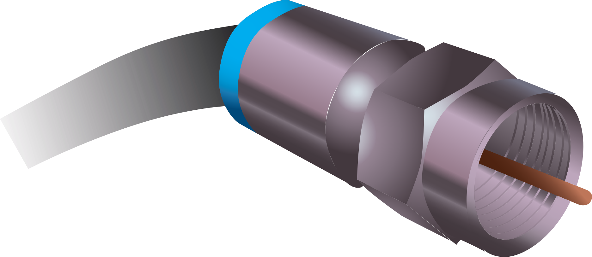

# Coaxial Cable (Coax)

🗓️ M/Y: Jul-25  
📂 Category: Transmission Media - Wired/Physical

---

## What is a Coaxial Cable?

Coaxial (or just "coax") is the OG wired cable.  
We’ve probably seen it coming out of walls for TVs, satellite dishes, or old broadband setups.

At its core, it’s just:
- **1 copper wire in the middle** → carries signal
- Surrounded by **insulation** → keeps signal in
- Covered by **metal shielding** → blocks outside interference
- Wrapped in a **plastic jacket** → so rats don’t cry

Think of it like a copper pipe inside a bigger pipe — both doing different jobs.

---

## Where is it used?

- **Cable TV**
- **DTH satellite**
- **Old broadband (DOCSIS / cable modem)**
- **CCTV cameras** in malls/buildings
- Sometimes used in RF (radio frequency) stuff

Basically, before fiber or twisted pairs took over, **coax was the king**.

---

## Types of Coax

| Type     | Usage                  | Core Info           |
|----------|------------------------|---------------------|
| RG-6     | TV & internet (modern) | Thicker, better quality |
| RG-59    | CCTV, older systems    | Thinner, weaker shielding |
| RG-11    | Long-distance TV runs  | Super thick boi |

No need to remember all of them — just know **RG-6 = internet/TV** and **RG-59 = CCTV**.

---

## Features:

- **Carries electrical signals** (not light like fiber)
- **Great shielding** against noise (that’s why TV signals look clean)
- Doesn’t support ultra high speeds like fiber — but still useful
- Connectors are usually **F-type** (not RJ45)
- Can travel longer than twisted pair without major signal loss

---

## Coax vs Ethernet vs Fiber

| Feature        | Coax           | Ethernet (Cat6)       | Fiber              |
|----------------|----------------|------------------------|--------------------|
| Signal Type    | Electrical     | Electrical             | Light              |
| Speed (avg)    | ~100 Mbps–1 Gbps | Up to 10 Gbps (Cat6a) | 1–10+ Gbps easily  |
| Use Case       | TV, CCTV, Old Net | LAN / Home Networks   | High-speed ISP stuff |
| Interference   | Low            | Moderate (UTP)         | None               |
| Connector Type | F-Type         | RJ45                   | SC/LC Connectors   |

---

## Summary

- Coax was used a lot in older broadband (via **DOCSIS modems**)
- Still used in homes for TV or CCTV
- We can’t just plug coax into a router — needs a **modem** to convert it
- Speeds are okay, but not ideal anymore
- It’s tough and durable, often used for long cable runs

---

## Final words

Coaxial isn’t dead.  
It's just old-school now, being replaced by fiber or high-speed Ethernet.  
But it’s still doing its job in homes, cameras, and TVs without complaint.

If fiber is a Tesla, and Ethernet is a good sedan — coax is that dusty old Maruti 800 that just won’t die.

---
