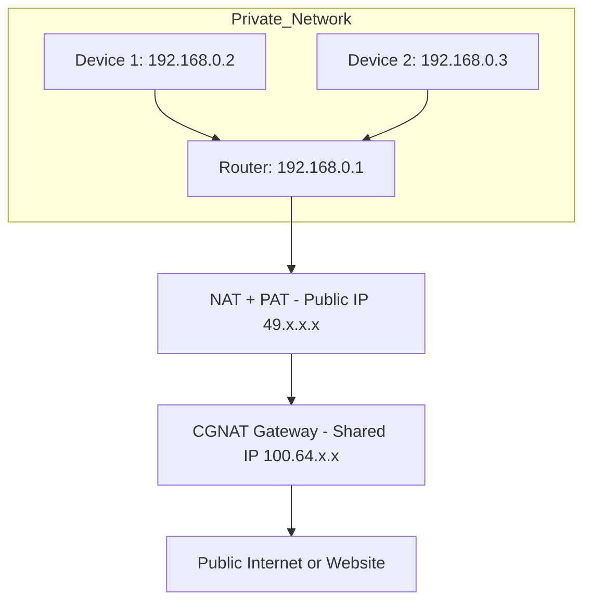

# NAT, PAT & CGNAT

🗓️ M/Y: Jul-25  
📂 Category: Core Concepts  

---

##  NAT (Network Address Translation)

**What it does:**  
Takes a **private IP** (like 192.168.x.x) and swaps it with a **public IP** (like 49.x.x.x) before sending it to the internet.

Why?  
Because private IPs can’t directly access the internet — they aren’t globally unique.

**How it works:**
- Us: 192.168.0.2 → google.com
- Router: “I’ll change that to my public IP” → 49.x.x.x
- Google replies to 49.x.x.x
- Router knows the request came from us → sends reply back to 192.168.0.2

Nobody outside knows we were the sender.

---

## PAT (Port Address Translation)

**AKA:** NAT Overload  
**Used in:** Almost every home and office

PAT is the most common form of NAT — it lets multiple devices use the **same** public IP, but maps them with **different ports**.

**Example:**

| Device | Private IP | Port |
|--------|------------|------|
| PC     | 192.168.0.3 | 5151 |
| Phone  | 192.168.0.5 | 5152 |

Our router maps them like:

| Private IP:Port     | → | Public IP:Port       |
|---------------------|----|----------------------|
| 192.168.0.3:5151     | → | 49.x.x.x:10001       |
| 192.168.0.5:5152     | → | 49.x.x.x:10002       |

So replies from the internet get sent to the correct device using that port number.

**Bottom line:**  
With PAT, **one public IP** = supports **many devices** by using port numbers.

---

## CGNAT (Carrier Grade NAT)

**Where NAT becomes our ISP’s problem**

Our ISP doesn’t give each customer a real public IP — instead, **many users share a single public IP**, just like our home devices do.

- Our router → does NAT
- ISP’s system → does **another layer** of NAT (CGNAT)

This means:

| Our Device | → | Our Router (NAT) | → | ISP Gateway (CGNAT) | → | Internet |

So our traffic is **double NAT’ed**.

---

### CGNAT Problems

- **Port Forwarding** doesn’t work properly (unless my ISP assigns a real public IP)
- Hosting games, servers, torrents, etc. becomes hard or impossible
- IP-based geolocation can be wonky
- Harder for incoming connections to reach us

---

## Final Comparison

| Feature       | NAT                     | PAT                           | CGNAT                        |
|---------------|--------------------------|--------------------------------|-------------------------------|
| What it is    | Changes private → public IP | NAT with port numbers        | ISP-level NAT                |
| Where it runs | My router              | My router                    | My ISP                     |
| Public IP     | One per router           | One for **all devices**        | One for **multiple customers** |
| Port Use      | Optional                 | **Mandatory**                  | Mandatory                    |
| Port Forward? | ✅ Usually possible      | ✅ Yes                          | ❌ Often blocked              |
| Common use    | All home networks        | All home networks              | Cheap ISPs, mobile networks  |

---

## Overall

- **NAT** = Replaces private IP with public IP
- **PAT** = Like NAT but uses ports → lets multiple devices share one IP
- **CGNAT** = ISP does NAT too, meaning **we share** a public IP with strangers

---

