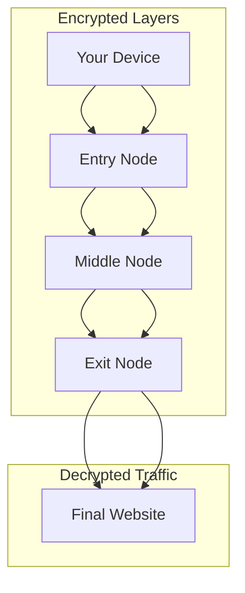

# TOR (The Onion Router)

🗓️ M/Y: Jul-25  
📂 Category: Security Concepts  

---

## What is TOR?

TOR is basically like throwing our internet traffic into a blender full of onions, garlic, and dark magic — so that no one knows where it came from.

It hides our identity by bouncing our traffic through multiple random servers around the world (called **relays**), so it becomes very hard to trace us.

Think of it like this:
> us → node 1 → node 2 → node 3 → target website  
> and every node only knows *the previous and the next one* — not the full chain.

---

##  🧅 The Onion Metaphor

It’s called **The Onion Router** because the data gets wrapped in multiple layers of encryption.  
Each relay peels off **one** layer and passes it forward.

That’s:
- **Layer 1**: Entry Node
- **Layer 2**: Middle Node
- **Layer 3**: Exit Node

By the time it reaches the final site, it’s peeled. But no single point knows everything.  
*Not even our ISP knows where we’re going. (just that we connected to TOR)*

---

## What about the Exit Node?

This is important:  
The **Exit Node** is where our traffic *finally* hits the real internet.  
At that point, it's decrypted. So if we're not using HTTPS — someone **can** spy on it.

So yes:
- Our IP is hidden
- But the Exit Node can *see* our raw request if it’s insecure (HTTP)

Don’t send passwords over HTTP. Ever.

---

## Why use TOR?

- **Anonymity** (for real)
- **Bypass censorship**
- Access .onion (hidden) websites
- Hide location & IP
- Avoid tracking and fingerprinting (mostly)

TOR is used by:
- Journalists
- Activists
- Privacy freaks
- Even some… not-so-nice people

But remember — using TOR ≠ doing shady stuff.  
It’s just privacy. And privacy is a right.

---

##  Stuff to know

- TOR is **slow** — because our traffic jumps through 3+ nodes
- TOR Browser is built on Firefox with tons of privacy patches
- Never resize your window. Don’t install extensions. Don’t log into real accounts.
- Don’t torrent. Ever. Not on TOR.
- Some sites block TOR users completely (even bans)

---

## .onion Sites

Sites that end with `.onion` can only be accessed through the TOR network.  
They’re hosted anonymously and don’t exist on normal browsers.

Examples:
- ProtonMail’s onion: `protonmail.com` → `protonirockerxow.onion`
- DuckDuckGo has an onion version too

---

## Is TOR illegal?

**NO.** Using TOR is 100% legal in most countries.  
But what we do on it… *that’s* what could get us in trouble.

Just don’t be stupid.

---

## Overall

| Question | Answer |
|---------|--------|
| What is it? | A privacy-focused network that hides my IP |
| Why use it? | To stay anonymous, bypass censorship, access .onion |
| Is it fast? | Nope. Not built for speed |
| Is it illegal? | No, but don’t misuse it |
| What browser? | TOR Browser (based on Firefox) |

---

*🧅 Privacy is a right. Not a suspicious activity.*
